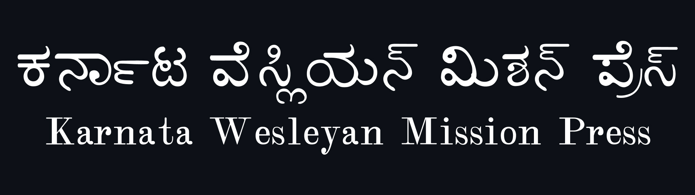
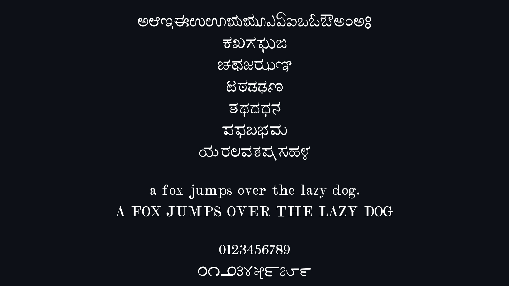
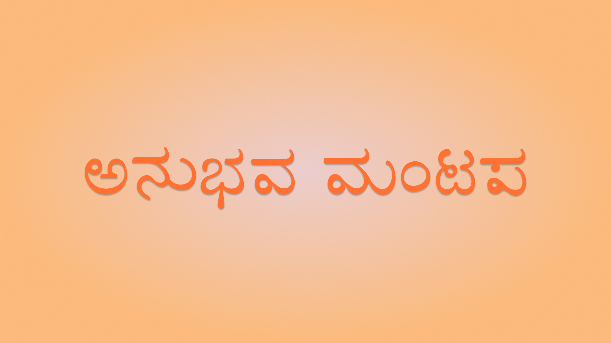

# ಕರ್ನಾಟ ವೆಸ್ಲಿಯನ್ ಮಿಷನ್ ಪ್ರೆಸ್ / Karnata Wesleyan Mission Press

ವೆಸ್ಲಿಯನ್ ಮಿಷನ್ ಪ್ರೆಸ್ ಮುದ್ರಣಗಳ ಕನ್ನಡ ಅಕ್ಷರಶೈಲಿಯ ಡಿಜಿಟಲ್ ರೂಪ.

Digital revival of a historical Kannada typeface from Wesleyan Mission Press prints.

---

## ಪ್ರಕ್ರಿಯೆ / Process

**ಮೂಲ**
- ಹಳೆಯ ಮುದ್ರಿತ ಪುಸ್ತಕಗಳಿಂದ (ಮಂಗಳೂರು / ಬೆಂಗಳೂರು / ಮೈಸೂರು ಪ್ರದೇಶ) ಉತ್ತಮ ಗುಣಮಟ್ಟದ ಸ್ಕ್ಯಾನ್‌ಗಳು.
- ಅಧಿಕೃತ ಶಾಯಿ ಮುದ್ರೆಗಳು ಮತ್ತು ಮೂಲ ಅಕ್ಷರ ರೂಪಗಳ ಮಕೇಂದ್ರೀಕರಣ.

**ಡಿಜಿಟಲೀಕರಣ**
- ಕಪ್ಪು ಮತ್ತು ಬಿಳಿ ಬಣ್ಣಕ್ಕೆ ಪರಿವರ್ತಿಸಲಾದ ಸ್ಕ್ಯಾನ್‌ಗಳು
- ಸ್ಕ್ಯಾನ್ ಗಳನ್ನು SVG ಗೆ ಪರಿವರ್ತಿಸಲಾಯಿತು

**ಗ್ಲಿಫ್ ಹೊರತೆಗೆಯುವಿಕೆ**
- ಕೈಯಾರೆ ಪ್ರತ್ಯೇಕಿಸಲಾದ ಗ್ಲಿಫ್‌ಗಳ ಸೃಜನೆ
- ಶಾಯಿ ಹಾಕಿದ ಆಕಾರಗಳನ್ನು ಮಾತ್ರ ಉಳಿಸಿಕೊಂಡಿದೆ

**ಅಭಿವೃದ್ಧಿ**
- ಫಾಂಟ್‌ಲ್ಯಾಬ್‌ಗೆ ಗ್ಲಿಫ್ಗಳನ್ನು ಇಂಪೋರ್ಟ್ ಮಾಡಲಾಯಿತು
- ಯೂನಿಕೋಡ್‌ಗೆ ಮ್ಯಾಪ್ ಮಾಡಲಾಗಿದೆ (ಕನ್ನಡ ಮೊದಲು)
- ತಿದ್ದುಪಡಿಗಳೊಂದಿಗೆ ಸಂಸ್ಕರಿಸಿದ ಆಕಾರಗಳು

**ಲ್ಯಾಟಿನ್ ಬೆಂಬಲ**
- ಅದೇ ಮೂಲದಿಂದ ಲ್ಯಾಟಿನ್ ಅನ್ನು ಸೇರಿಸಲಾಗಿದೆ

**ವಿನ್ಯಾಸ ವಿಧಾನ**
- ಸಂರಕ್ಷಿತ ರಚನೆ ಮತ್ತು ಅನುಪಾತಗಳು
- ಸ್ಪಷ್ಟತೆಗಾಗಿ ಕನಿಷ್ಠ ತಿದ್ದುಪಡಿಗಳು

**ಎಂಜಿನಿಯರಿಂಗ್**
- ಯೂನಿಕೋಡ್-ಕಂಪ್ಲೈಂಟ್ ರಚನೆ
- ಓಪನ್‌ಟೈಪ್ ಕನ್ನಡ ಆಕಾರಗಳು
- ಅಂತರ ಮತ್ತು ಮೆಟ್ರಿಕ್‌ಗಳನ್ನು ಹೊಂದಿಸಲಾಗಿದೆ

**Source**
- High-quality scans from old printed books (Mangalore / Bangalore / Mysore region)
- Focus on authentic ink impressions and original letterforms

**Digitisation**
- Converted scans to black & white
- Separated ink from paper
- Generated clean SVG outlines

**Glyph Extraction**
- Manually isolated glyphs
- Retained only inked shapes (removed noise)

**Development**
- Imported into FontLab
- Mapped to Unicode (Kannada first)
- Refined shapes with minimal corrections

**Latin Support**
- Added Latin from same source
- Ensured stylistic consistency

**Design Approach**
- Preserved structure and proportions
- Minimal intervention for clarity

**Engineering**
- Unicode-compliant structure
- Basic OpenType for Kannada shaping
- Spacing and metrics adjusted

---

## ಔಟ್‌ಪುಟ್ / Output

- ಏಕ ತೂಕದ ಫಾಂಟ್
- ಪುಸ್ತಕ ಟೈಪ್‌ಸೆಟ್ಟಿಂಗ್‌ಗಾಗಿ ಅತ್ಯುತ್ತಮವಾಗಿಸಲಾಗಿದೆ
- OTF ಆಗಿ ಎಕ್ಸ್ಪೋರ್ಟ್ ಮಾಡಲಾಗಿದೆ

- Single weight font  
- Optimised for book typesetting  
- Exported as OTF

---

## Contributors

Arun C Kallappanavar

Vaishnavi Murthy

Omshivaprakash H L

Abhaya Simha

---
